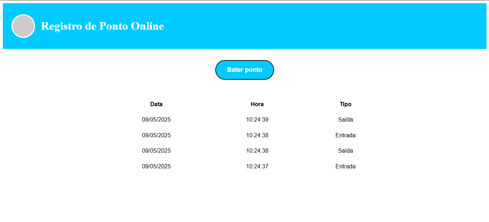

# 🕒 Registro de Ponto Online

Este projeto é uma aplicação web simples feita com **Angular**, que permite aos usuários registrarem entradas e saídas de forma rápida e visual. É ideal para estudo e prototipação de sistemas de ponto eletrônico com interface intuitiva.

---

## 📸 Preview



---

## 🔧 Funcionalidades

- Registrar ponto com alternância automática entre **Entrada** e **Saída**
- Exibição de registros com **Data**, **Hora** e **Tipo**
- Interface responsiva com layout moderno inspirado no **Figma**
- Estilização em CSS personalizada com cabeçalho colorido e botão estilizado

---

## 🚀 Tecnologias

- [Angular: 19.2.10](https://angular.io/)
- TypeScript
- HTML5
- CSS3

---

## 📁 Estrutura do Projeto

```
src/
├── app/
│   ├── registro-ponto/
│   │   ├── registro-ponto.component.ts
│   │   ├── registro-ponto.component.html
│   │   └── registro-ponto.component.css
│   ├── app.component.ts
│   ├── app.component.html
│   └── app.config.ts
├── main.ts
```

---

## ▶️ Como Rodar

1. Clone o repositório:
   ```bash
   git clone https://github.com/seu-usuario/registro-ponto.git
   cd registro-ponto
   ```

2. Instale as dependências:
   ```bash
   npm install
   ```

3. Inicie o servidor de desenvolvimento:
   ```bash
   ng serve
   ```

4. Acesse no navegador:
   ```
   http://localhost:4200
   ```

---

## 🎨 Design

O layout foi baseado em um protótipo feito no **Figma**, com foco em clareza e usabilidade. A interface tem:

- Cabeçalho azul com avatar circular
- Botão de ação centralizado
- Tabela organizada para visualização dos registros

---

## 📄 Licença

Este projeto é open-source, feito para fins de estudo.

---

## ✨ Autor

Desenvolvido por **Alexandre Melo**  
📧 alemelo18lds@gmail.com